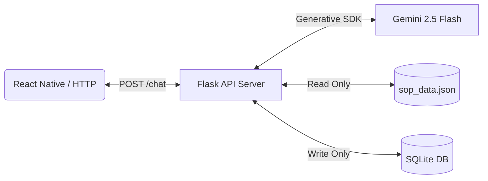

# Closira Backend — AI Customer Support API & Engine


The backend engine of **Closira**, an intelligent, autonomous customer support agent built to answer customer inquiries for **Breakout Escape Rooms** (Mumbai and Bangalore locations) grounded strictly in corporate Standard Operating Procedures (SOP). Powered by **Google Gemini 2.5 Flash** and **Flask**.

---

## 📑 Table of Contents
- [🧠 Backend Architecture](#-backend-architecture)
- [📋 System Requirements & Setup](#-system-requirements--setup)
- [🧠 Zero-Hallucination & SOP Grounding](#-zero-hallucination--sop-grounding)
- [🚨 10-Point Escalation Matrix & NLP Sentiment](#-10-point-escalation-matrix--nlp-sentiment)
- [📡 Web API Endpoints](#-web-api-endpoints)
- [🗄️ Database Schema & Logging](#%ufe0f-database-schema--logging)
- [💬 CLI Mode](#-cli-mode)
- [🛠️ Troubleshooting (Windows Console Fixes)](#%ufe0f-troubleshooting-windows-console-fixes)

---

## 🧠 Backend Architecture

The backend operates as a decoupled RESTful Web API and CLI agent. It intercepts incoming HTTP POST requests, injects system prompts, live system dates, and the raw company SOP database (`sop_data.json`) directly into the Gemini model, and generates structured, valid JSON replies.



---

## 📋 System Requirements & Setup

### Prerequisites
*   Python 3.10 or higher
*   A valid **Google Gemini API Key** (obtainable from [Google AI Studio](https://aistudio.google.com/app/apikey))

### 1. Installation
Navigate to the root project folder in your terminal and install dependencies:
```bash
cd c:/Users/nitaa/Downloads/Breakout_Assignment
pip install -r requirements.txt
```

### 2. Configure Environment variables
Create a `.env` file in the root folder:
```env
GEMINI_API_KEY="AIzaSyYourActualGoogleGeminiApiKey"
```

### 3. Run the Web Server
Launch the Flask development server on port 5000:
```bash
python app.py
```
*Output will display:* `[*] Closira is starting on http://127.0.0.1:5000`

---

## 🧠 Zero-Hallucination & SOP Grounding

Closira is heavily grounded in the company's Standard Operating Procedure (`sop_data.json`).
*   **Rules of Engagement:** The model is prohibited from guessing, estimating, or inventing any escape rooms, pricing tiers, game timings, or discount policies.
*   **Missing SOP Info:** If a customer inquires about a topic outside the SOP (e.g., VR games, external catering, custom designs), the AI must respond exactly with: `"I am unable to help with that."` and immediately mark the ticket as `needs_escalation: true`.
*   **Location Disambiguation:** Since Breakout operates in both Mumbai and Bangalore with different price scales, if a customer asks a general question without specifying the city, the backend catches the ambiguity and clarifying prompt: `"Sure! We have locations in both Mumbai and Bangalore. Which city are you asking about?"`

---

## 🚨 10-Point Escalation Matrix & NLP Sentiment

Closira utilizes natural language processing (NLP) to analyze customer messages. The engine automatically sets `"needs_escalation": true` and lists the reason if any of these 10 scenarios occur:
1.  **Unsupported/Out-of-SOP Question:** Asking questions not documented in `sop_data.json`.
2.  **Frustration/Anger:** Detecting negative sentiment or intense complaints.
3.  **Refund Requests:** Asking for booking cancellations or refunds.
4.  **Injury/Safety Complaints:** Reporting accidents inside the escape rooms.
5.  **Technical Failure:** Broken locks, sensors, or clues during a game.
6.  **Discount Negotiation:** Requesting custom coupons or bargaining for discounts.
7.  **Large Corporate Bookings:** Asking to book for groups above 20 players.
8.  **Explicit Human Request:** Typing "I want to speak with a real person."
9.  **Repeated AI Failure:** Expressing confusion with the AI's answers ("That's not what I asked").
10. **Legal/Liability Questions:** Inquiring about accident waivers or lockers liability.

---

## 📡 Web API Endpoints

### 1. Chat Completion API
*   **Endpoint:** `POST /chat`
*   **Request Headers:** `Content-Type: application/json`
*   **Request Body Schema:**
    ```json
    {
      "message": "Is Haunted Mansion available in Mumbai?",
      "conversation_id": "session_rahul_99"
    }
    ```
*   **Success Response Schema (200 OK):**
    ```json
    {
      "answer": "Yes! Haunted Mansion is available at our Mumbai location in Phoenix Marketcity...",
      "confidence": 1.0,
      "needs_escalation": false,
      "escalation_reason": null,
      "lead_qualification_questions": [
        "What date are you planning to visit?",
        "How many players are in your group?"
      ]
    }
    ```

### 2. Retrieve SOP Database
*   **Endpoint:** `GET /sop`
*   **Response:** Raw contents of `sop_data.json`.

### 3. Retrieve Location Rooms
*   **Endpoint:** `GET /rooms/<location>` (e.g. `/rooms/mumbai`)
*   **Response:** JSON list of active escape rooms, difficulty tiers, and headcounts.

### 4. Clear Conversation History
*   **Endpoint:** `DELETE /chat/<conversation_id>`
*   **Response:** `{"status": "cleared", "conversation_id": "..."}`

---

## 🗄️ Database Schema & Logging

Every conversation is logged in the local SQLite database `conversations.db` across two tables:

### 1. `messages` Table
Tracks every single query and reply.
*   `session_id` (TEXT)
*   `timestamp` (TEXT)
*   `role` (TEXT: `'user'` or `'assistant'`)
*   `content` (TEXT)

### 2. `summaries` Table
Saves chat summaries generated when sessions close.
*   `session_id` (TEXT)
*   `timestamp` (TEXT)
*   `summary` (TEXT)

*To review conversation tables inside your terminal, run:*
```bash
python view_db.py
```

---

## 💬 CLI Mode

For local diagnostics, run the interactive command line console:
```bash
python app.py --cli
```
*   **`reset`**: Clear the local session memory and restart.
*   **`quit`**: Terminate the session and trigger the AI to save the chat summary in the SQLite database.

---

## 🛠️ Troubleshooting (Windows Console Fixes)

### 1. malformed Database Disk Image
*   **Symptom:** `sqlite3.DatabaseError: database disk image is malformed`
*   **Reason:** The binary `conversations.db` was corrupted.
*   **Resolution:** Delete `conversations.db` from your project root. The Flask app will automatically initialize a fresh, healthy database file on start.

### 2. UnicodeEncodeError on Windows Server Launch
*   **Symptom:** `UnicodeEncodeError: 'charmap' codec can't encode character '\U0001f680'`
*   **Reason:** Windows console environments run `cp1252` encoding by default and cannot render unicode emojis.
*   **Resolution:** The startup print statement has been replaced with ASCII `[*]`. The server runs perfectly.
